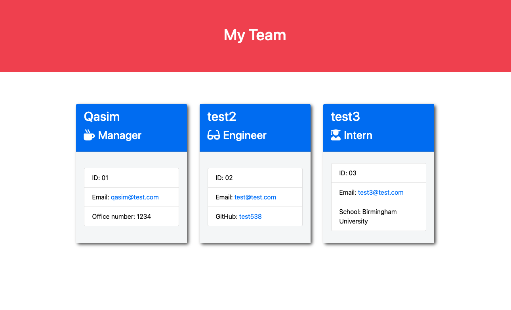

# team-profile-generator
This is CLI app to generate team profile so manage can access data of employee by typing name id etc

## The Task
This week task was to create a CLI app to create a team cards.

# User Story
I want to add team features:
 
I want to add Ttile
 
I want to add Name
 
I want to add ID
 
I want to add Email/Github/Uni

## Approach

HTML and CSS style and coding for JS using different resources for help.

## Responsiveness and Media Queries:
Fully responsible for different screen sizes

## Techenologies:
This is a JavaScrip project.
wit very basic HTML and CSS.

## Deploy:
I deploy this website by using GitHub commands 
Git Clone, git add., git push.
And shared a live link for review.

## License:
I have added a MIT license. This is free website and anyone can use it.

## Links to Repository
Here is the link to repository:
https://github.com/Qasim538/team-profile-generator

## Links to Application
Here is the link to the online application:
https://github.com/Qasim538/team-profile-generator/

## Links to my Github
https://github.com/Qasim538

# Preview

# Live Demo
Here is the link to the online video for demo:
https://www.youtube.com/watch?v=BopIpLuNsyc

